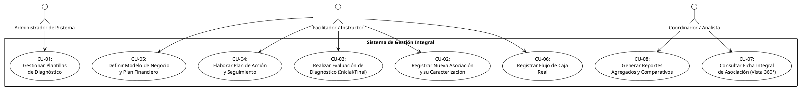

**hojas**

El archivo Excel contiene las siguientes hojas:

1. **DESPLEGABLE__CF_D_M_V**
    
2. **CARACTERIZACIÓN**
    
3. **BD**
    
4. **Indice**
    
5. **Registro**
    
6. **Proyecto Productivo**
    
7. **Diagnostico Entrada**
    
8. **CANVAS**
    
9. **Costos**
    
10. **Ventas**
    
11. **Flujo de caja**
    
12. **Presupuesto**
    
13. **Ficha de Producto**
    
14. **Ficha de Servicio**
    
15. **Plan de Acción**
    
16. **Plan de Mercadeo**
    
17. **Diagnostico Salida**

-  **Registro**

| Sección                                                  | Variable                                                     | Autocompletar | Información                   |
| :------------------------------------------------------- | :----------------------------------------------------------- | :------------ | :---------------------------- |
| **Caracterización General**                              | Ruta de intervención                                         | si            |                               |
|                                                          | Departamento                                                 | si            | Lista de departamentos        |
|                                                          | Municipio                                                    | si            | Lista de Municipios           |
|                                                          | Vereda                                                       | si            | Lista de Veredas              |
|                                                          | Código UP Sofia plus                                         |               |                               |
|                                                          | Regional                                                     | si            | Lista de Regionales           |
|                                                          | Centro de Formación                                          | si            | Lista de Centro de Formación. |
|                                                          | Código Ficha Formación                                       |               |                               |
|                                                          | Nombre completo del Diseño Curricular                        |               |                               |
|                                                          | Código del diseño                                            |               |                               |
|                                                          | Versión del diseño curricular                                |               |                               |
|                                                          | Dirección                                                    |               |                               |
|                                                          | Longitud                                                     |               |                               |
|                                                          | Latitud                                                      |               |                               |
|                                                          | Fecha Diligenciamiento (dd/mm/aa)                            |               |                               |
|                                                          | Nombre Instructor                                            |               |                               |
|                                                          | Correo Instructor                                            |               |                               |
|                                                          | N° Contacto Instructor                                       |               |                               |
| **Información Representante Legal / Gerente Asociación** | Nombre representante Legal                                   |               |                               |
|                                                          | Género                                                       | si            |                               |
|                                                          | Tipo de población                                            | si            |                               |
|                                                          | Edad                                                         |               |                               |
|                                                          | Nivel de estudios                                            | si            |                               |
|                                                          | Correo electrónico                                           |               |                               |
|                                                          | Rol                                                          | si            |                               |
|                                                          | Celular                                                      |               |                               |
|                                                          | Tiempo dedicación en la Asociación                           | si            |                               |
|                                                          | Tiempo en la Asociación                                      |               |                               |
|                                                          | Técnico sobre la actividad                                   |               |                               |
|                                                          | Tiene conocimiento en habilidades gerenciales                |               |                               |
|                                                          | Temas de interes para capacitación                           |               |                               |
|                                                          | No Documento Rep legal/gerente asociacion                    |               |                               |
| **Organización**                                         | Tipo de Organización                                         | si            |                               |
|                                                          | Formalizada                                                  | si            |                               |
|                                                          | Sector Productivo Principal                                  | si            |                               |
|                                                          | ¿La principal razón por la cuál se creó la organización fue? |               |                               |
|                                                          | NIT                                                          |               |                               |
|                                                          | Código CIIU                                                  |               |                               |
|                                                          | Producto o Servicio Principal                                |               |                               |
| **Registro Grupo (Tabla)**                               | TIPO Documento                                               | si            |                               |
|                                                          | No DOCUMENTO                                                 |               |                               |
|                                                          | NOMBRE COMPLETO                                              |               |                               |
|                                                          | ROL DENTRO DEL                                               | si            |                               |
|                                                          | GENERO                                                       | si            |                               |
|                                                          | FECHA DE NACIMIENTO                                          |               |                               |
|                                                          | EDAD                                                         |               |                               |
|                                                          | TIPO POBLACIÓN                                               | Si            |                               |
|                                                          | TELEFONO DE CONTACTO                                         |               |                               |
|                                                          | INGRESOS MENSUALES PROMEDIO                                  |               |                               |

¡Perfecto! Analicemos esta nueva hoja del proceso. Este formulario, "PROYECTO PRODUCTIVO", es una pieza clave que se conecta directamente con la entidad `Asociacion` que definimos anteriormente.

A continuación, se presenta el desglose de todas las variables contenidas en este nuevo formulario, organizadas por secciones, tal como se solicita.

### **Análisis de Variables del Formulario: Proyecto Productivo**

Basado en la imagen, el formulario se puede estructurar en cuatro secciones principales que describen la naturaleza, el impacto y el contexto del proyecto.

---

### **1. Información General del Proyecto**

Esta sección recopila los datos identificativos y de contexto del proyecto productivo.

**Lista de Variables:**
*   Regional
*   Centro de formación
*   Nombre del Proyecto
*   Programa de Formación al que da respuesta
*   Tiempo estimado de ejecución del proyecto (meses)
*   Nombre del Instructor competencias técnicas
*   Nombre del Instructor de emprendimiento
*   Proyecto local/municipal/regional al cual da respuesta el proyecto productivo

---

### **2. Descripción del Proyecto**

Esta sección se enfoca en la descripción fundamental del proyecto: el qué, el porqué y el para quién.

**Lista de Variables:**
*   Planteamiento del problema o necesidad que se pretende solucionar
*   Justificación del proyecto
*   Beneficiarios del proyecto

---

### **3. Impacto del Proyecto**

Aquí se detalla el impacto esperado del proyecto en diferentes dimensiones.

**Lista de Variables:**
*   Impacto Social
*   Impacto Económico
*   Impacto Ambiental
*   Impacto Tecnológico

---

### **4. Análisis del Contexto**

Esta última sección evalúa el entorno en el que se desarrollará el proyecto, utilizando un análisis similar al PEST (Político, Económico, Social, Tecnológico).

**Lista de Variables:**
*   Tendencias
*   Factores políticos
*   Factores Económicos
*   Factores sociales
*   Factores tecnológicos
*   Incertidumbres

Claro, aquí tienes la tabla que resume las variables del formulario "Proyecto Productivo", organizadas por sección.

| Sección                              | Variable                                                                      |
| :----------------------------------- | :---------------------------------------------------------------------------- |
| **Información General del Proyecto** | Regional                                                                      |
|                                      | Centro de formación                                                           |
|                                      | Nombre del Proyecto                                                           |
|                                      | Programa de Formación al que da respuesta                                     |
|                                      | Tiempo estimado de ejecución del proyecto (meses)                             |
|                                      | Nombre del Instructor competencias técnicas                                   |
|                                      | Nombre del Instructor de emprendimiento                                       |
|                                      | Proyecto local/municipal/regional al cual da respuesta el proyecto productivo |
| **Descripción del Proyecto**         | Planteamiento del problema o necesidad que se pretende solucionar             |
|                                      | Justificación del proyecto                                                    |
|                                      | Beneficiarios del proyecto                                                    |
| **Impacto del Proyecto**             | Impacto Social                                                                |
|                                      | Impacto Económico                                                             |
|                                      | Impacto Ambiental                                                             |
|                                      | Impacto Tecnológico                                                           |
| **Análisis del Contexto**            | Tendencias                                                                    |
|                                      | Factores políticos                                                            |
|                                      | Factores Económicos                                                           |
|                                      | Factores sociales                                                             |
|                                      | Factores tecnológicos                                                         |
|                                      | Incertidumbres                                                                |

---

### **Diccionario de Datos del Sistema**

---

### **Módulo 1: Entidades Fundamentales (Actores)**

#### **Tabla: `CentroFormacion`**
*   **Propósito:** Almacena los datos de los centros de formación.

| Nombre del Atributo   | Tipo de Dato | Clave / Restricción     | Descripción                             |
| :-------------------- | :----------- | :---------------------- | :-------------------------------------- |
| `id_centro_formacion` | INT          | **PK (Clave Primaria)** | Identificador único del centro.         |
| `nombre`              | VARCHAR(255) |                         | Nombre oficial del centro de formación. |
| `direccion`           | VARCHAR(255) |                         | Dirección física específica.            |
| `id_regional`         | INT          | **FK a `Regional`**     | Relaciona el centro con su regional.    |
| `id_municipio`        | INT          | **FK a `Municipio`**    | Relaciona el centro con su municipio.   |

#### **Tabla: `Tercero`**
*   **Propósito:** Entidad central para almacenar datos de cualquier persona (participante, instructor, representante).

| Nombre del Atributo  | Tipo de Dato | Clave / Restricción     | Descripción                        |
| :------------------- | :----------- | :---------------------- | :--------------------------------- |
| `id_tercero`         | INT          | **PK (Clave Primaria)** | Identificador único de la persona. |
| `numero_documento`   | VARCHAR(20)  | **UK (Clave Única)**    | Número de documento de identidad.  |
| `nombre_completo`    | VARCHAR(255) |                         | Nombre y apellidos.                |
| `genero`             | VARCHAR(50)  |                         | Género de la persona.              |
| `correo_electronico` | VARCHAR(255) | **UK (Clave Única)**    | Dirección de correo electrónico.   |

---

### **Módulo 2: Caracterización y Planificación Estratégica**

#### **Tabla: `Asociacion`**
*   **Propósito:** Contiene la información principal de cada asociación o unidad productiva.

| Nombre del Atributo      | Tipo de Dato | Clave / Restricción     | Descripción                                         |
| :----------------------- | :----------- | :---------------------- | :-------------------------------------------------- |
| `id_asociacion`          | INT          | **PK (Clave Primaria)** | Identificador único de la asociación.               |
| `nit`                    | VARCHAR(20)  | **UK (Clave Única)**    | NIT de la asociación.                               |
| `nombre_asociacion`      | VARCHAR(255) |                         | Razón social o nombre de la asociación.             |
| `formalizada`            | BOOLEAN      |                         | Indica si está legalmente constituida (True/False). |
| `id_representante_legal` | INT          | **FK a `Tercero`**      | Apunta al `id_tercero` del representante legal.     |
| `id_municipio`           | INT          | **FK a `Municipio`**    | Ubicación principal de la asociación.               |
| `id_vereda`              | INT          | **FK a `Vereda`**       | Ubicación específica de la asociación.              |

#### **Tabla: `ParticipanteAsociacion`**
*   **Propósito:** Vincula a los terceros (personas) con una asociación, definiendo su rol.

| Nombre del Atributo    | Tipo de Dato  | Clave / Restricción     | Descripción                                                  |
| :--------------------- | :------------ | :---------------------- | :----------------------------------------------------------- |
| `id_participante`      | INT           | **PK (Clave Primaria)** | Identificador único de la membresía.                         |
| `id_tercero`           | INT           | **FK a `Tercero`**      | Relaciona al participante con sus datos personales.          |
| `id_asociacion`        | INT           | **FK a `Asociacion`**   | Relaciona al participante con su asociación.                 |
| `rol_dentro_del_grupo` | VARCHAR(100)  |                         | El rol específico que desempeña (ej. 'Tesorero', 'Miembro'). |
| `ingresos_mensuales`   | DECIMAL(15,2) |                         | Ingresos mensuales aproximados del participante.             |

#### **Tabla: `ProyectoProductivo`**
*   **Propósito:** Almacena la información detallada de una iniciativa o proyecto de una asociación.

| Nombre del Atributo | Tipo de Dato | Clave / Restricción     | Descripción                                                    |
| :------------------ | :----------- | :---------------------- | :------------------------------------------------------------- |
| `id_proyecto`       | INT          | **PK (Clave Primaria)** | Identificador único del proyecto.                              |
| `id_asociacion`     | INT          | **FK a `Asociacion`**   | Vínculo a la asociación que desarrolla el proyecto.            |
| `nombre_proyecto`   | VARCHAR(255) |                         | Nombre oficial del proyecto.                                   |
| ...                 | TEXT         |                         | (Resto de campos de texto como justificación, impactos, etc.). |

#### **Tabla: `Portafolio`**
*   **Propósito:** Contiene las fichas técnicas de los productos o servicios ofrecidos en un proyecto.

| Nombre del Atributo      | Tipo de Dato   | Clave / Restricción           | Descripción                                                     |
| :----------------------- | :------------- | :---------------------------- | :-------------------------------------------------------------- |
| `id_portafolio`          | INT            | **PK (Clave Primaria)**       | Identificador único del ítem del portafolio.                    |
| `tipo_item`              | VARCHAR(10)    |                               | 'Producto' o 'Servicio'.                                        |
| `nombre_comercial`       | VARCHAR(255)   |                               | Nombre con el que se vende.                                     |
| `id_proyecto_productivo` | INT            | **FK a `ProyectoProductivo`** | Relaciona el producto/servicio con su proyecto.                 |
| ...                      | TEXT / VARCHAR | *Nullable*                    | (Resto de campos comunes y específicos para producto/servicio). |

#### **Tabla: `PlanDeMercadeo`**
*   **Propósito:** Almacena los planes de mercadeo detallados para un proyecto productivo.

| Nombre del Atributo      | Tipo de Dato   | Clave / Restricción           | Descripción                                                    |
| :----------------------- | :------------- | :---------------------------- | :------------------------------------------------------------- |
| `id_plan_mercadeo`       | INT            | **PK (Clave Primaria)**       | Identificador único del plan.                                  |
| `id_proyecto_productivo` | INT            | **FK a `ProyectoProductivo`** | Relaciona el plan con el proyecto específico.                  |
| ...                      | TEXT / DECIMAL |                               | (Resto de campos para los análisis y estrategias de mercadeo). |

---

### **Módulo 3: Diagnóstico y Plan de Acción**

#### **Tabla: `DiagnosticoPlantilla`**
*   **Propósito:** Define la estructura de una versión de la herramienta de diagnóstico.

| Nombre del Atributo | Tipo de Dato | Clave / Restricción     | Descripción                                  |
| :------------------ | :----------- | :---------------------- | :------------------------------------------- |
| `id_plantilla`      | INT          | **PK (Clave Primaria)** | Identificador único de la plantilla.         |
| `nombre_plantilla`  | VARCHAR(255) |                         | Nombre descriptivo de la plantilla.          |
| `version`           | VARCHAR(20)  | **UK (Clave Única)**    | Versión de la plantilla (ej. "V1.0 - 2024"). |

#### **Tabla: `SeccionDiagnostico`**
*   **Propósito:** Define las secciones que componen una plantilla de diagnóstico.

| Nombre del Atributo | Tipo de Dato | Clave / Restricción             | Descripción                                       |
| :------------------ | :----------- | :------------------------------ | :------------------------------------------------ |
| `id_seccion`        | INT          | **PK (Clave Primaria)**         | Identificador único de la sección.                |
| `nombre_seccion`    | VARCHAR(255) |                                 | Nombre de la sección (ej. "Aspectos de Mercado"). |
| `id_plantilla`      | INT          | **FK a `DiagnosticoPlantilla`** | Relaciona la sección con su plantilla.            |

#### **Tabla: `CriterioEvaluacion`**
*   **Propósito:** Almacena cada pregunta o criterio a evaluar dentro de una sección.

| Nombre del Atributo | Tipo de Dato | Clave / Restricción           | Descripción                           |
| :------------------ | :----------- | :---------------------------- | :------------------------------------ |
| `id_criterio`       | INT          | **PK (Clave Primaria)**       | Identificador único del criterio.     |
| `texto_criterio`    | TEXT         |                               | El texto de la pregunta a evaluar.    |
| `id_seccion`        | INT          | **FK a `SeccionDiagnostico`** | Relaciona el criterio con su sección. |

#### **Tabla: `EvaluacionDiagnostico`**
*   **Propósito:** Registra una aplicación del diagnóstico (inicial o final) a una asociación.

| Nombre del Atributo | Tipo de Dato | Clave / Restricción             | Descripción                            |
| :------------------ | :----------- | :------------------------------ | :------------------------------------- |
| `id_evaluacion`     | INT          | **PK (Clave Primaria)**         | Identificador único de una evaluación. |
| `fecha_aplicacion`  | DATE         |                                 | Fecha en que se realizó la evaluación. |
| `tipo_evaluacion`   | VARCHAR(10)  |                                 | 'Inicial' o 'Final'.                   |
| `id_asociacion`     | INT          | **FK a `Asociacion`**           | Asociación que fue evaluada.           |
| `id_plantilla`      | INT          | **FK a `DiagnosticoPlantilla`** | Plantilla que se utilizó.              |

#### **Tabla: `RespuestaCriterio`**
*   **Propósito:** Almacena la respuesta (puntaje y hallazgos) para un criterio específico en una evaluación.

| Nombre del Atributo | Tipo de Dato | Clave / Restricción              | Descripción                               |
| :------------------ | :----------- | :------------------------------- | :---------------------------------------- |
| `id_respuesta`      | INT          | **PK (Clave Primaria)**          | Identificador único de la respuesta.      |
| `puntaje_obtenido`  | INT          |                                  | Puntaje asignado (0, 1 o 2).              |
| `hallazgos`         | TEXT         |                                  | Descripción cualitativa del hallazgo.     |
| `id_evaluacion`     | INT          | **FK a `EvaluacionDiagnostico`** | Relaciona la respuesta con su evaluación. |
| `id_criterio`       | INT          | **FK a `CriterioEvaluacion`**    | Relaciona la respuesta con la pregunta.   |

#### **Tabla: `PlanDeAccion`**
*   **Propósito:** Registro maestro para un plan de acción, originado por un diagnóstico.

| Nombre del Atributo    | Tipo de Dato | Clave / Restricción              | Descripción                      |
| :--------------------- | :----------- | :------------------------------- | :------------------------------- |
| `id_plan`              | INT          | **PK (Clave Primaria)**          | Identificador único del plan.    |
| `fecha_elaboracion`    | DATE         |                                  | Fecha en que se creó el plan.    |
| `id_evaluacion_origen` | INT          | **FK a `EvaluacionDiagnostico`** | Diagnóstico que originó el plan. |

#### **Tabla: `ActividadPlan`**
*   **Propósito:** Almacena cada tarea (5W2H) de un plan de acción.

| Nombre del Atributo    | Tipo de Dato | Clave / Restricción     | Descripción                          |
| :--------------------- | :----------- | :---------------------- | :----------------------------------- |
| `id_actividad`         | INT          | **PK (Clave Primaria)** | Identificador único de la actividad. |
| `que_hacer`            | TEXT         |                         | Descripción de la actividad (Qué).   |
| `id_plan`              | INT          | **FK a `PlanDeAccion`** | Relaciona la actividad con su plan.  |
| `id_responsable_quien` | INT          | **FK a `Tercero`**      | Apunta al responsable de la tarea.   |
| ...                    | TEXT / DATE  |                         | (Resto de campos 5W2H).              |

#### **Tabla: `SeguimientoActividad`**
*   **Propósito:** Registra los avances periódicos de una actividad del plan de acción.

| Nombre del Atributo  | Tipo de Dato | Clave / Restricción      | Descripción                                     |
| :------------------- | :----------- | :----------------------- | :---------------------------------------------- |
| `id_seguimiento`     | INT          | **PK (Clave Primaria)**  | Identificador único del reporte de seguimiento. |
| `fecha_seguimiento`  | DATE         |                          | Notas sobre el progreso realizado.              |
| `descripcion_avance` | TEXT         |                          | Notas sobre el progreso realizado.              |
| `id_actividad`       | INT          | **FK a `ActividadPlan`** | Relaciona el seguimiento con su actividad.      |

---

### **Módulo 4: Planificación y Control Financiero**

#### **Tabla: `ModeloNegocioCanvas`**
*   **Propósito:** Almacena los 9 bloques del Business Model Canvas y los totales financieros.

| Nombre del Atributo | Tipo de Dato   | Clave / Restricción     | Descripción                                   |
| :------------------ | :------------- | :---------------------- | :-------------------------------------------- |
| `id_modelo_canvas`  | INT            | **PK (Clave Primaria)** | Identificador único del modelo de negocio.    |
| `id_asociacion`     | INT            | **FK a `Asociacion`**   | Relaciona el Canvas con su asociación.        |
| ...                 | TEXT / DECIMAL |                         | (Resto de campos para los bloques y totales). |

#### **Tabla: `ItemCosto`**
*   **Propósito:** Almacena cada línea detallada de la estructura de costos.

| Nombre del Atributo | Tipo de Dato | Clave / Restricción            | Descripción                                  |
| :------------------ | :----------- | :----------------------------- | :------------------------------------------- |
| `id_item_costo`     | INT          | **PK (Clave Primaria)**        | Identificador único del ítem de costo.       |
| `descripcion`       | VARCHAR(255) |                                | Nombre o descripción del costo.              |
| `tipo_costo`        | VARCHAR(10)  |                                | 'Fijo' o 'Variable'.                         |
| `id_modelo_canvas`  | INT          | **FK a `ModeloNegocioCanvas`** | Relaciona el costo con su modelo de negocio. |

#### **Tabla: `ItemInversion`**
*   **Propósito:** Almacena cada línea detallada del presupuesto de inversión.

| Nombre del Atributo | Tipo de Dato | Clave / Restricción            | Descripción                                      |
| :------------------ | :----------- | :----------------------------- | :----------------------------------------------- |
| `id_item_inversion` | INT          | **PK (Clave Primaria)**        | Identificador único del ítem de inversión.       |
| `descripcion`       | VARCHAR(255) |                                | Descripción de la inversión.                     |
| `tipo_inversion`    | VARCHAR(20)  |                                | 'Inicial' o 'CapitalTrabajo'.                    |
| `id_modelo_canvas`  | INT          | **FK a `ModeloNegocioCanvas`** | Relaciona la inversión con su modelo de negocio. |

#### **Tabla: `ProyeccionFinanciera`**
*   **Propósito:** Registro maestro para una proyección financiera anual.

| Nombre del Atributo | Tipo de Dato | Clave / Restricción            | Descripción                                       |
| :------------------ | :----------- | :----------------------------- | :------------------------------------------------ |
| `id_proyeccion`     | INT          | **PK (Clave Primaria)**        | Identificador único de la proyección.             |
| `anio_proyeccion`   | INTEGER      |                                | El año para el cual se realiza la proyección.     |
| `id_modelo_canvas`  | INT          | **FK a `ModeloNegocioCanvas`** | Relaciona la proyección con el modelo de negocio. |

#### **Tabla: `DatoMensualProyeccion`**
*   **Propósito:** Almacena las cifras proyectadas para cada mes de una proyección.

| Nombre del Atributo | Tipo de Dato | Clave / Restricción             | Descripción                                        |
| :------------------ | :----------- | :------------------------------ | :------------------------------------------------- |
| `id_dato_mensual`   | INT          | **PK (Clave Primaria)**         | Identificador único del registro mensual.          |
| `id_proyeccion`     | INT          | **FK a `ProyeccionFinanciera`** | Relaciona el dato mensual con su proyección anual. |
| `mes`               | INTEGER      |                                 | El número del mes (1 a 12).                        |

#### **Tabla: `FlujoCajaAnual`**
*   **Propósito:** Registro maestro para el control de flujo de caja real de un año.

| Nombre del Atributo | Tipo de Dato | Clave / Restricción     | Descripción                                       |
| :------------------ | :----------- | :---------------------- | :------------------------------------------------ |
| `id_flujo_caja`     | INT          | **PK (Clave Primaria)** | Identificador único del control de flujo de caja. |
| `anio`              | INTEGER      |                         | Año al que corresponde el control.                |
| `id_asociacion`     | INT          | **FK a `Asociacion`**   | Relaciona el control de caja con la asociación.   |

#### **Tabla: `ResumenMensualCaja`**
*   **Propósito:** Almacena los totales y saldos reales de caja para cada mes.

| Nombre del Atributo  | Tipo de Dato | Clave / Restricción       | Descripción                                |
| :------------------- | :----------- | :------------------------ | :----------------------------------------- |
| `id_resumen_mensual` | INT          | **PK (Clave Primaria)**   | Identificador único del resumen de un mes. |
| `id_flujo_caja`      | INT          | **FK a `FlujoCajaAnual`** | Relaciona el resumen con su control anual. |
| `mes`                | INTEGER      |                           | El número del mes (1 a 12).                |

#### **Tabla: `MovimientoCaja`**
*   **Propósito:** Registra cada transacción real de ingreso o egreso.

| Nombre del Atributo  | Tipo de Dato | Clave / Restricción           | Descripción                                    |
| :------------------- | :----------- | :---------------------------- | :--------------------------------------------- |
| `id_movimiento`      | INT          | **PK (Clave Primaria)**       | Identificador único de la transacción.         |
| `id_resumen_mensual` | INT          | **FK a `ResumenMensualCaja`** | Relaciona el movimiento con su mes.            |
| `descripcion`        | TEXT         |                               | Descripción del movimiento.                    |
| `tipo_movimiento`    | VARCHAR(20)  |                               | 'Ingreso', 'Egreso Fijo', 'Egreso Variable'.   |
| `fecha_movimiento`   | DATE         |                               | La fecha exacta en que ocurrió la transacción. |

---

### **Módulo 5: Ubicación Geográfica**

#### **Tabla: `Regional`**
*   **Propósito:** Almacena las regionales a las que pertenecen los centros de formación.

| Nombre del Atributo | Tipo de Dato | Clave / Restricción     | Descripción                         |
| :------------------ | :----------- | :---------------------- | :---------------------------------- |
| `id_regional`       | INT          | **PK (Clave Primaria)** | Identificador único de la regional. |
| `nombre`            | VARCHAR(100) | **UK (Clave Única)**    | Nombre de la regional.              |

#### **Tabla: `Departamento`**
*   **Propósito:** Almacena los departamentos de Colombia.

| Nombre del Atributo | Tipo de Dato | Clave / Restricción     | Descripción                           |
| :------------------ | :----------- | :---------------------- | :------------------------------------ |
| `id_departamento`   | INT          | **PK (Clave Primaria)** | Identificador único del departamento. |
| `nombre`            | VARCHAR(100) | **UK (Clave Única)**    | Nombre del departamento.              |

#### **Tabla: `Municipio`**
*   **Propósito:** Almacena los municipios, vinculados a su departamento.

| Nombre del Atributo | Tipo de Dato | Clave / Restricción     | Descripción                                 |
| :------------------ | :----------- | :---------------------- | :------------------------------------------ |
| `id_municipio`      | INT          | **PK (Clave Primaria)** | Identificador único del municipio.          |
| `nombre`            | VARCHAR(100) |                         | Nombre del municipio.                       |
| `id_departamento`   | INT          | **FK a `Departamento`** | Relaciona el municipio con su departamento. |

#### **Tabla: `Vereda`**
*   **Propósito:** Almacena las veredas o localidades, vinculadas a su municipio.

| Nombre del Atributo | Tipo de Dato | Clave / Restricción     | Descripción                           |
| :------------------ | :----------- | :---------------------- | :------------------------------------ |
| `id_vereda`         | INT          | **PK (Clave Primaria)** | Identificador único de la vereda.     |
| `nombre`            | VARCHAR(100) |                         | Nombre de la vereda.                  |
| `id_municipio`      | INT          | **FK a `Municipio`**    | Relaciona la vereda con su municipio. |

---

### **Documento de Casos de Uso: Sistema de Gestión Integral para Fortalecimiento de Asociaciones**

#### **1. Actores del Sistema**

Identificamos tres roles principales que interactuarán con el sistema:

1.  **Facilitador / Instructor:** Es el usuario de primera línea. Trabaja directamente con las asociaciones, recopila la información de los formularios y registra los avances. Su objetivo es la entrada y seguimiento de datos.
2.  **Coordinador / Analista:** Es un rol de supervisión y análisis. Necesita visualizar la información de manera agregada, generar reportes, medir el impacto de las intervenciones y consultar el estado de múltiples asociaciones. No introduce datos, pero los consume para la toma de decisiones.
3.  **Administrador del Sistema:** Es el superusuario. Tiene todos los permisos de los roles anteriores y, además, es responsable de la configuración y el mantenimiento del sistema, como la creación de las plantillas de diagnóstico.

#### **2. Diagrama de Casos de Uso General**

Este diagrama ofrece una vista de pájaro de las interacciones principales en el sistema.

---

#### **3. Descripción Detallada de los Casos de Uso**

| **ID**              | **CU-01: Gestionar Plantillas de Diagnóstico**                                                                                                                                                                                                                                                                                                                                |
| :------------------ | :---------------------------------------------------------------------------------------------------------------------------------------------------------------------------------------------------------------------------------------------------------------------------------------------------------------------------------------------------------------------------- |
| **Actor(es)**       | Administrador del Sistema                                                                                                                                                                                                                                                                                                                                                     |
| **Descripción**     | Permite al administrador crear, modificar y versionar las plantillas de la "Herramienta de Diagnóstico". Esto incluye definir las secciones (Operación, Mercado, etc.) y los criterios (preguntas) de cada sección. Es la base de la parametrización del sistema.                                                                                                             |
| **Flujo Principal** | 1. El Administrador accede al módulo "Administración de Plantillas". 2. Crea una nueva plantilla (ej. "Diagnóstico V2 - 2025"). 3. Dentro de la plantilla, crea las secciones y define su puntaje máximo. 4. Dentro de cada sección, añade los criterios de evaluación (las preguntas). 5. Guarda y activa la plantilla para que los facilitadores puedan usarla. |

| **ID**              | **CU-02: Registrar Nueva Asociación y su Caracterización Completa**                                                                                                                                                                                                                                                                                                                          |
| :------------------ | :------------------------------------------------------------------------------------------------------------------------------------------------------------------------------------------------------------------------------------------------------------------------------------------------------------------------------------------------------------------------------------------- |
| **Actor(es)**       | Facilitador / Instructor                                                                                                                                                                                                                                                                                                                                                                     |
| **Descripción**     | Permite registrar una nueva asociación en el sistema y diligenciar toda su información inicial, incluyendo sus participantes, el proyecto productivo que desarrolla y el portafolio de productos/servicios que ofrece.                                                                                                                                                                       |
| **Flujo Principal** | 1. El Facilitador selecciona "Registrar Nueva Asociación". 2. Ingresa los datos generales de la asociación y su representante legal (`Asociacion`, `Tercero`). 3. Añade a los participantes (`ParticipanteAsociacion`). 4. Crea el `ProyectoProductivo` asociado. 5. Dentro del proyecto, crea una o más `FichaTecnica` (`Portafolio`) para cada producto o servicio que ofrece. |

| **ID**              | **CU-03: Realizar Evaluación de Diagnóstico (Inicial/Final)**                                                                                                                                                                                                                                                                                                                                                                                  |
| :------------------ | :---------------------------------------------------------------------------------------------------------------------------------------------------------------------------------------------------------------------------------------------------------------------------------------------------------------------------------------------------------------------------------------------------------------------------------------------------------------------------- |
| **Actor(es)**       | Facilitador / Instructor                                                                                                                                                                                                                                                                                                                                                                                                                                                      |
| **Descripción**     | El facilitador aplica una evaluación de diagnóstico a una asociación en un momento determinado (inicial o final). El sistema le presenta la plantilla de preguntas y guarda las respuestas y hallazgos.                                                                                                                                                                                                                                                                       |
| **Flujo Principal** | 1. El Facilitador busca una asociación y selecciona "Aplicar Diagnóstico". 2. Elige la `DiagnosticoPlantilla` activa. 3. Especifica el tipo de evaluación: **"Inicial"** o **"Final"**. 4. El sistema muestra las preguntas por sección. 5. Para cada criterio, el facilitador registra el puntaje (0, 1, 2) y los hallazgos cualitativos (`RespuestaCriterio`). 6. Al finalizar, el sistema calcula los puntajes totales y guarda la `EvaluacionDiagnostico`. |

| **ID**              | **CU-04: Elaborar Plan de Acción y Seguimiento**                                                                                                                                                                                                                                                                                                                                                                                                             |
| :------------------ | :-------------------------------------------------------------------------------------------------------------------------------------------------------------------------------------------------------------------------------------------------------------------------------------------------------------------------------------------------------------------------------------------------------------------------------------------------------------------------- |
| **Actor(es)**       | Facilitador / Instructor                                                                                                                                                                                                                                                                                                                                                                                                                                                                    |
| **Descripción**     | A partir de los hallazgos de un diagnóstico, el facilitador construye un Plan de Acción 5W2H, asignando tareas concretas. Posteriormente, puede registrar los avances de cada tarea.                                                                                                                                                                                                                                                                         |
| **Flujo Principal** | 1. El Facilitador abre una `EvaluacionDiagnostico` completada y selecciona "Crear Plan de Acción". 2. El sistema crea un `PlanDeAccion` vinculado. 3. Para cada hallazgo (`RespuestaCriterio`), el facilitador añade una o más `ActividadPlan`, completando los campos Qué, Por Qué, Cómo, Quién, Dónde y Cuándo. 4. Posteriormente, el facilitador puede abrir una actividad y añadir un `SeguimientoActividad`, registrando la fecha, el avance y el porcentaje de cumplimiento. |

| **ID**              | **CU-05: Definir Modelo de Negocio y Plan Financiero**                                                                                                                                                                                                                                                                                                                                                      |
| :------------------ | :---------------------------------------------------------------------------------------------------------------------------------------------------------------------------------------------------------------------------------------------------------------------------------------------------------------------------------------------------------------------------------------------------------- |
| **Actor(es)**       | Facilitador / Instructor                                                                                                                                                                                                                                                                                                                                                                                    |
| **Descripción**     | Permite al facilitador registrar y detallar la estrategia de negocio de una asociación, incluyendo el Business Model Canvas, el desglose de costos e inversión, las proyecciones y el plan de mercadeo.                                                                                                                                                                                                     |
| **Flujo Principal** | 1. Dentro de la ficha de una `Asociacion`, el facilitador crea un `ModeloNegocioCanvas`. 2. Rellena los 9 bloques del Canvas. 3. En la sección financiera, detalla cada `ItemCosto` e `ItemInversion`. 4. Crea la `ProyeccionFinanciera` anual, ingresando los datos para cada `DatoMensualProyeccion`. 5. Opcionalmente, crea y detalla un `PlanDeMercadeo` vinculado al `ProyectoProductivo`. |

| **ID**              | **CU-06: Registrar Flujo de Caja Real**                                                                                                                                                                                                                                                                                                                                            |
| :------------------ | :--------------------------------------------------------------------------------------------------------------------------------------------------------------------------------------------------------------------------------------------------------------------------------------------------------------------------------------------------------------------------------- |
| **Actor(es)**       | Facilitador / Instructor                                                                                                                                                                                                                                                                                                                                                           |
| **Descripción**     | Permite registrar los movimientos de dinero reales (ingresos y egresos) de una asociación para llevar un control financiero mes a mes.                                                                                                                                                                                                                                             |
| **Flujo Principal** | 1. El Facilitador accede al módulo de "Flujo de Caja" de una asociación. 2. Selecciona el año y el mes. 3. El sistema muestra el `ResumenMensualCaja` (saldo inicial, totales). 4. El Facilitador añade nuevos `MovimientoCaja`, especificando descripción, fecha, valor y si es un ingreso o un egreso. 5. El sistema recalcula los totales y el saldo final del mes. |

| **ID**              | **CU-07: Consultar Ficha Integral de Asociación (Vista 360°)**                                                                                                                                                                                                                                                               |
| :------------------ | :--------------------------------------------------------------------------------------------------------------------------------------------------------------------------------------------------------------------------------------------------------------------------------------------------------------------------- |
| **Actor(es)**       | Coordinador / Analista, Facilitador                                                                                                                                                                                                                                                                                          |
| **Descripción**     | El sistema debe proveer una vista unificada donde se pueda consultar toda la información relacionada con una única asociación: sus datos generales, sus proyectos, sus diagnósticos, sus planes de acción, su modelo de negocio y su estado financiero.                                                                      |
| **Flujo Principal** | 1. El usuario busca y selecciona una asociación. 2. El sistema presenta un "dashboard" o ficha integral con diferentes pestañas: Caracterización, Diagnósticos, Plan de Acción, Modelo de Negocio, Flujo de Caja, etc. 3. El usuario puede navegar por las pestañas para ver toda la información de manera organizada. |

| **ID**              | **CU-08: Generar Reportes Agregados y Comparativos**                                                                                                                                                                                                                                                                                                                                                                                       |
| :------------------ | :----------------------------------------------------------------------------------------------------------------------------------------------------------------------------------------------------------------------------------------------------------------------------------------------------------------------------------------------------------------------------------------------------------------------------------------- |
| **Actor(es)**       | Coordinador / Analista                                                                                                                                                                                                                                                                                                                                                                                                                     |
| **Descripción**     | El sistema debe permitir la generación de reportes que consoliden la información de múltiples asociaciones. El objetivo es medir el impacto general y analizar tendencias.                                                                                                                                                                                                                                                                 |
| **Flujo Principal** | 1. El Coordinador accede al módulo de "Reportería". 2. Selecciona un reporte predefinido (ej. "Comparativo Diagnóstico Inicial vs. Final", "Estado de Avance de Planes de Acción por Región", "Inversión Total por Sector Productivo"). 3. Aplica filtros si es necesario (ej. por fechas, por regional, por instructor). 4. El sistema genera el reporte en pantalla (tablas o gráficos) y permite su exportación a Excel o PDF. |